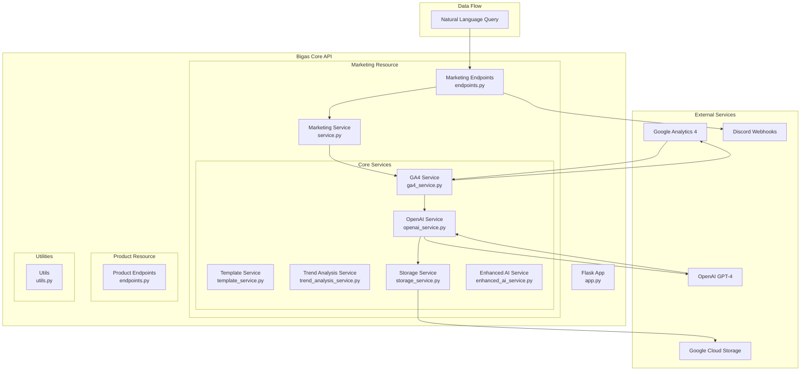
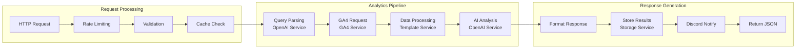

# Bigas Core - Marketing Analytics AI Engine

[](https://www.python.org/downloads/)
[](https://flask.palletsprojects.com/)
[](https://developers.google.com/analytics/devguides/reporting/data/v1)
[](https://platform.openai.com/docs)
[](https://modelcontextprotocol.io/)

Bigas Core is a Flask-based AI-powered marketing analytics engine that transforms Google Analytics 4 data into actionable business insights. It combines real-time analytics data with OpenAI's GPT-4 to deliver intelligent recommendations through natural language queries and automated reporting.

## 🔌 Model Context Protocol (MCP) Integration

**✅ Fully MCP 2025 Compliant Server** - Ready for AI client integration

Bigas Core implements the [Model Context Protocol (MCP)](https://modelcontextprotocol.io/) specification, making it compatible with MCP-enabled AI clients like Claude and other LLM applications.

### MCP Configuration

```json
{
    "manifestUrl": "https://mcp-marketing-919623369853.europe-north1.run.app/mcp/manifest",
    "openapiUrl": "https://mcp-marketing-919623369853.europe-north1.run.app/openapi.json"
}
```

### MCP Features
- **10 MCP Tools**: Complete analytics toolkit accessible via natural language
- **JSON-RPC 2.0**: Standard MCP transport protocol
- **Secure HTTPS**: Production-ready with proper authentication
- **Tool Categories**: Analytics queries, report generation, storage management, page optimization

### Quick MCP Integration
1. Add the above configuration to your MCP client
2. Access tools via natural language: *"Generate a weekly analytics report"*
3. Use storage tools: *"Get the latest stored report"* 
4. Analyze pages: *"Find underperforming pages and suggest improvements"*

> **Note**: Live analytics tools require SaaS application context. Storage and report analysis tools work directly via MCP.

## 🏗️ Architecture Overview



### Component Architecture



## 🚀 Core Features

### 📊 **Natural Language Analytics**
Transform questions like "What are my top traffic sources?" into structured GA4 queries and receive AI-powered insights.

### 📈 **Automated Trend Analysis**
Compare current and previous periods with intelligent trend detection and business impact analysis.

### 📄 **Weekly Reports**
Comprehensive automated reports with 7 predefined analytics questions, stored in Google Cloud Storage.

### 🔍 **Underperforming Page Analysis**
AI-powered deep dive into pages with high traffic but low conversions, including content scraping and optimization recommendations.

### ⚡ **Real-time Caching**
1-hour intelligent caching system to optimize GA4 API usage and response times.

### 🔒 **Enterprise Security**
Rate limiting, input validation, and secure credential management for production environments.

## 📡 API Endpoints

### Marketing Analytics Endpoints

| Endpoint | Method | Description | Function |
|----------|--------|-------------|----------|
| `/mcp/tools/fetch_analytics_report` | POST | Standard GA4 report with basic metrics | `fetch_analytics_report()` |
| `/mcp/tools/fetch_custom_report` | POST | Custom GA4 report with specified dimensions/metrics | `fetch_custom_report()` |
| `/mcp/tools/ask_analytics_question` | POST | Natural language query processing | `ask_analytics_question()` |
| `/mcp/tools/analyze_trends` | POST | Trend analysis with AI insights | `analyze_trends()` |
| `/mcp/tools/weekly_analytics_report` | POST | Generate comprehensive weekly report | `weekly_analytics_report()` |
| `/mcp/tools/get_stored_reports` | GET | List all stored weekly reports | `get_stored_reports()` |
| `/mcp/tools/get_latest_report` | GET | Retrieve most recent weekly report | `get_latest_report()` |
| `/mcp/tools/analyze_underperforming_pages` | POST | Deep analysis of underperforming pages | `analyze_underperforming_pages()` |
| `/mcp/tools/cleanup_old_reports` | POST | Clean up old stored reports | `cleanup_old_reports()` |

### System Endpoints

| Endpoint | Method | Description | Function |
|----------|--------|-------------|----------|
| `/mcp/manifest` | GET | Combined MCP manifest | `combined_manifest()` |
| `/openapi.json` | GET | OpenAPI specification | `openapi_spec()` |

### Product Management Endpoints

| Endpoint | Method | Description | Function |
|----------|--------|-------------|----------|
| `/mcp/tools/product_resource_placeholder` | POST | Placeholder for future product management features | `product_placeholder()` |

## 🛠️ Core Services Documentation

### GA4Service (`ga4_service.py`)
**Purpose**: Handle all Google Analytics 4 API interactions

#### Key Functions:
- `__init__()`: Initialize GA4 client with service account credentials
- `build_report_request(property_id, query_params)`: Build GA4 report requests from parsed queries
- `run_report(request)`: Execute GA4 API requests
- `get_trend_analysis(property_id, metrics, dimensions, time_frames)`: Multi-period trend analysis
- `run_template_query(property_id, template, date_range)`: Execute predefined template queries

**Features**:
- Automatic metric/dimension mapping from Universal Analytics to GA4
- Service account authentication with fallback
- Comprehensive error handling and logging

### OpenAIService (`openai_service.py`)
**Purpose**: Natural language processing and AI-powered insights generation

#### Key Functions:
- `__init__(openai_api_key)`: Initialize OpenAI client
- `parse_query(question)`: Convert natural language to structured GA4 queries
- `format_response(response, question)`: Transform GA4 data into natural language answers
- `format_response_obj(data, question)`: Format filtered/processed data into insights
- `generate_trend_insights(formatted_trends, metrics, dimensions, date_range)`: AI trend analysis
- `generate_traffic_sources_analysis(data)`: Specialized traffic source insights

**Features**:
- GPT-4 powered query parsing with GA4 compatibility validation
- Intelligent data formatting with business context
- Comprehensive prompt engineering for marketing insights

### TemplateService (`template_service.py`)
**Purpose**: Manage predefined analytics query templates for consistent reporting

#### Key Functions:
- `__init__(ga4_service)`: Initialize with GA4 service dependency
- `get_template(template_key)`: Retrieve specific template configuration
- `list_templates()`: List all available templates
- `run_template_query(template_key, property_id, date_range)`: Execute template-based queries
- `get_traffic_sources_data()`: Traffic source analysis template
- `get_session_quality_data()`: Session quality metrics template
- `get_top_pages_conversions_data()`: Top converting pages template
- `get_engagement_pages_data()`: High engagement pages template
- `get_underperforming_pages_data()`: Underperforming pages identification template
- `get_blog_conversion_data()`: Blog content conversion analysis template

**Available Templates**:
- `traffic_sources`: Primary traffic sources and session share
- `session_quality`: Session duration and pages per session
- `top_pages_conversions`: Most visited pages with conversion data
- `engagement_pages`: High engagement pages with low bounce rates
- `underperforming_pages`: High traffic, low conversion pages
- `blog_conversion`: Blog content conversion attribution

### TrendAnalysisService (`trend_analysis_service.py`)
**Purpose**: Orchestrate multi-period trend analysis with AI insights

#### Key Functions:
- `__init__(ga4_service, openai_service)`: Initialize with service dependencies
- `get_default_time_frames()`: Default 7-day and 30-day comparison periods
- `get_time_frames_for_date_range(date_range)`: Dynamic time frame generation
- `analyze_trends(property_id, metrics, dimensions, time_frames)`: Core trend analysis
- `analyze_trends_with_insights(property_id, metrics, dimensions, date_range)`: Trends with AI insights
- `get_weekly_trend_analysis(property_id)`: Specialized weekly report trends

**Features**:
- Configurable comparison periods
- Automatic percentage change calculations
- AI-powered trend interpretation and business recommendations

### StorageService (`storage_service.py`)
**Purpose**: Manage report storage and retrieval using Google Cloud Storage

#### Key Functions:
- `__init__(bucket_name)`: Initialize GCS client and bucket
- `store_weekly_report(report_data, report_date)`: Store weekly reports with metadata
- `get_latest_weekly_report()`: Retrieve most recent report
- `get_weekly_report_by_date(report_date)`: Get specific report by date
- `list_available_reports()`: List all stored reports with metadata
- `delete_old_reports(keep_days, max_reports_to_delete)`: Cleanup old reports
- `get_report_summary(report_data)`: Extract key summary from reports
- `_extract_page_urls_from_raw_data(raw_data)`: Extract page URLs from GA4 data for analysis

**Features**:
- Automatic bucket creation and management
- Structured metadata with versioning
- Efficient cleanup and cost management
- Page URL extraction for content analysis

### MarketingAnalyticsService (`service.py`)
**Purpose**: Main orchestration service coordinating all marketing analytics operations

#### Key Functions:
- `__init__(openai_api_key)`: Initialize all service dependencies
- `answer_question(property_id, question)`: Process natural language analytics questions
- `run_template_query(template_key, date_range)`: Execute template-based queries
- `get_trend_analysis(property_id, metrics, dimensions, time_frames)`: Trend analysis coordination
- `analyze_trends_with_insights(formatted_trends, metrics, dimensions, date_range)`: AI trend insights
- `answer_traffic_sources(date_range)`: Specialized traffic source analysis

### Enhanced AI Service (`enhanced_ai_service.py`)
**Purpose**: Advanced AI-powered recommendations and insights generation

#### Key Functions:
- Advanced recommendation generation with business context
- Company-specific insights with target keyword analysis
- Priority-based recommendation scoring
- Structured recommendation formatting for actionable insights

### Utility Functions (`utils.py`)
**Purpose**: Common utilities for data processing and validation

#### Key Functions:
- `convert_ga4_response_to_dict()`: Convert GA4 responses to JSON format
- `process_ga_response()`: Process and validate GA4 responses
- `validate_date_range()`: Date range validation
- `validate_ga4_metrics_dimensions()`: GA4 compatibility validation
- `sanitize_error_message()`: Security-focused error message sanitization
- `calculate_session_share()`: Traffic source percentage calculations
- `find_high_traffic_low_conversion()`: Underperforming page identification
- `format_trend_data_for_humans()`: Human-readable trend formatting

## 📊 Weekly Report System

The weekly report system generates comprehensive analytics insights through 7 predefined questions:

### Report Questions & Templates

1. **Trend Analysis** (`trend_analysis`)
   - Key trends in website performance over 30 days
   - User growth, session patterns, significant changes

2. **Traffic Sources** (`traffic_sources`)
   - Primary traffic sources and their session share
   - Organic search, direct, referral, paid, social, email breakdown

3. **Session Quality** (`session_quality`)
   - Average session duration across all users
   - Pages per session metrics

4. **Top Converting Pages** (`top_pages_conversions`)
   - Most visited pages and conversion contribution
   - Product pages, category pages, blog posts analysis

5. **High Engagement Pages** (`engagement_pages`)
   - Pages driving most engagement
   - Time on page and low bounce rate analysis

6. **Underperforming Pages** (`underperforming_pages`)
   - High traffic, low conversion page identification
   - Optimization opportunity identification

7. **Blog Conversion Attribution** (`blog_conversion`)
   - Blog content contribution to conversions
   - Assisted vs. last-click conversion analysis

### Report Features

- **AI-Powered Insights**: Each question receives GPT-4 analysis with business recommendations
- **Structured Recommendations**: Priority-based actionable recommendations with specific improvement suggestions
- **Automatic Storage**: Reports stored in Google Cloud Storage with metadata
- **Discord Integration**: Automated posting to Discord channels with formatted insights
- **Content Analysis**: Underperforming pages receive deep content scraping and optimization analysis

## 🎯 Underperforming Page Analysis

Advanced feature that combines GA4 data with web scraping for comprehensive page optimization:

### Analysis Process

1. **Data Extraction**: Extract underperforming pages from weekly reports
2. **Content Scraping**: Analyze actual page content including:
   - SEO elements (title, meta, headings, keywords)
   - UX elements (CTAs, forms, navigation)
   - Performance indicators (images, links, scripts)
3. **AI Analysis**: GPT-4 generates specific optimization recommendations:
   - Conversion Rate Optimization (CRO)
   - Search Engine Optimization (SEO)
   - User Experience (UX) improvements
4. **Priority Action Plan**: High/Medium/Low priority recommendations with expected impact

### Content Analysis Features

- **SEO Analysis**: Title optimization, meta descriptions, heading structure, keyword targeting
- **CTA Optimization**: Call-to-action placement, copy, and design analysis
- **Trust Building**: Social proof, testimonials, and credibility improvements
- **Mobile Experience**: Mobile-specific optimization recommendations
- **Performance**: Page speed and loading time improvements

## 🔧 Installation & Setup

### Prerequisites

- Python 3.11+
- Google Analytics 4 property with API access
- OpenAI API key
- Google Cloud Project with Storage API enabled
- (Optional) Discord webhook for notifications

### Environment Variables

```bash
# Required
GA4_PROPERTY_ID=your-ga4-property-id
OPENAI_API_KEY=your-openai-api-key
GOOGLE_APPLICATION_CREDENTIALS=/path/to/service-account.json

# Optional
STORAGE_BUCKET_NAME=your-storage-bucket
DISCORD_WEBHOOK_URL=your-discord-webhook-url
TARGET_KEYWORDS=keyword1:keyword2:keyword3
PORT=8080
```

### Local Development

```bash
# Clone and install
git clone <repository-url>
cd bigas-core
pip install -r requirements.txt

# Run locally
python app.py
# or
uvicorn app:app --host 0.0.0.0 --port 8080
```

### Docker Deployment

```bash
# Build and run
docker build -t bigas-core .
docker run -p 8080:8080 --env-file .env bigas-core
```

### Google Cloud Run Deployment

```bash
# Deploy using provided script
chmod +x deploy.sh
./deploy.sh
```

## 🧪 Testing

### Running Tests

```bash
# Core functionality tests
python tests/test_storage.py
python tests/test_domain_extraction.py

# Health check
python tests/health_check.py

# Integration tests
python tests/test_client.py
```

### Available Test Modules

- `test_storage.py`: Google Cloud Storage integration testing
- `test_domain_extraction.py`: Domain and URL processing validation
- `test_client.py`: API endpoint integration testing
- `health_check.py`: System health validation
- `auto_fix_test_runner.py`: Automated test execution with fixes

## 🔒 Security Features

### Input Validation
- Request data validation with required field checking
- Date range validation and sanitization
- Query parameter length limits and format validation
- URL validation for web scraping operations

### Rate Limiting
- 100 requests per hour per endpoint per client
- Configurable rate limiting windows
- Request count tracking with automatic cleanup

### Error Handling
- Sanitized error messages to prevent information disclosure
- Comprehensive logging without sensitive data exposure
- Graceful failure handling with proper HTTP status codes

### Authentication
- Google Cloud Service Account authentication
- API key validation for external services
- Secure credential management

## 🎨 Response Formats

### Standard API Response
```json
{
  "status": "success",
  "data": {
    "processed_data": "...",
    "insights": "..."
  },
  "metadata": {
    "timestamp": "2024-01-01T00:00:00Z",
    "processing_time": 1.5
  }
}
```

### Weekly Report Response
```json
{
  "status": "success",
  "report": {
    "summary": "Executive summary with key insights",
    "questions": [
      {
        "question": "Analytics question",
        "answer": "AI-generated answer",
        "recommendation": {
          "title": "Actionable recommendation",
          "description": "Detailed description",
          "priority": "high|medium|low",
          "category": "seo|cro|ux|general"
        }
      }
    ]
  },
  "stored": true,
  "storage_path": "weekly_reports/2024-01-01/report.json"
}
```

## 📈 Performance & Scalability

### Caching Strategy
- 1-hour intelligent caching for GA4 requests
- Cache key generation based on query parameters
- Automatic cache cleanup and memory management

### API Rate Management
- GA4 API quota optimization through caching
- Request batching for multiple metrics/dimensions
- Automatic retry logic with exponential backoff

### Cost Optimization
- Efficient GA4 API usage through template queries
- Automated old report cleanup to manage storage costs
- OpenAI token optimization through structured prompts

## 🚀 Advanced Features

### Multi-Period Analysis
Compare current performance against previous periods with:
- Automatic percentage change calculations
- Trend direction identification (growing/declining/stable)
- Statistical significance analysis
- Business impact assessment

### Content Intelligence
Advanced web scraping and content analysis:
- SEO element extraction and validation
- UX component identification (CTAs, forms, navigation)
- Performance metric collection (images, scripts, links)
- Keyword optimization analysis with target keyword matching

### AI-Powered Insights
Intelligent analysis powered by GPT-4:
- Natural language query interpretation
- Business context-aware recommendations
- Priority-based action plans
- Industry best practice integration

## 🔄 Integration Examples

### Natural Language Query
```bash
curl -X POST http://localhost:8080/mcp/tools/ask_analytics_question \
  -H "Content-Type: application/json" \
  -d '{"question": "What are my top traffic sources this month?"}'
```

### Custom Report Generation
```bash
curl -X POST http://localhost:8080/mcp/tools/fetch_custom_report \
  -H "Content-Type: application/json" \
  -d '{
    "dimensions": ["sessionDefaultChannelGroup", "country"],
    "metrics": ["sessions", "totalUsers"],
    "date_ranges": [
      {"start_date": "2024-01-01", "end_date": "2024-01-31", "name": "january"}
    ]
  }'
```

### Weekly Report Generation
```bash
curl -X POST http://localhost:8080/mcp/tools/weekly_analytics_report \
  -H "Content-Type: application/json"
```

## 📋 Development Roadmap

### Current Features ✅
- Natural language analytics queries
- Automated weekly reports with 7 predefined questions
- Trend analysis with AI insights
- Underperforming page analysis with content scraping
- Google Cloud Storage integration
- Discord webhook notifications

### Planned Enhancements 🚧
- Real-time dashboard widgets
- Custom report scheduling
- Advanced A/B testing analysis
- Competitor analysis integration
- Multi-property analytics support
- Advanced visualization exports

## 🤝 Contributing

This is the core analytics engine. When contributing:

1. Focus on marketing analytics functionality
2. Maintain backwards compatibility with existing API endpoints
3. Add comprehensive tests for new features
4. Follow existing code patterns and service architecture
5. Update documentation for new functions and endpoints

## 📄 License

This project is proprietary software. All rights reserved.

## 🆘 Support

For issues and support:
- Check the logs for detailed error information
- Validate all environment variables are properly configured
- Ensure Google Cloud Service Account has necessary permissions
- Verify GA4 property ID and API access

## 📚 Documentation & Compliance

### Technical Documentation
- **[MCP Compliance Report](MCP_COMPLIANCE_REPORT.md)** - Detailed MCP 2025 specification compliance analysis
- **[Server Investigation Report](SERVER_INVESTIGATION_REPORT.md)** - SaaS deployment architecture and endpoint analysis  
- **[Test Status Report](TEST_STATUS_REPORT.md)** - Comprehensive test coverage and results

### Requirements & Standards
- **[Model Context Protocol 2025](https://modelcontextprotocol.io/specification/2025-03-26)** - Official MCP specification
- **[Google Analytics 4 API](https://developers.google.com/analytics/devguides/reporting/data/v1)** - GA4 reporting requirements
- **[OpenAI API Documentation](https://platform.openai.com/docs)** - AI integration guidelines

### Compliance Status
- ✅ **MCP 2025 Compliant** (95/100 score)
- ✅ **Production Ready** - Fully functional MCP server
- ✅ **Security Compliant** - Meets OAuth Resource Server requirements
- ✅ **SaaS Architecture** - Multi-tenant deployment ready

## 🏷️ Version

**Version**: 1.1  
**Last Updated**: September 2025  
**Compatibility**: Google Analytics 4, OpenAI GPT-4, Python 3.11+, MCP 2025