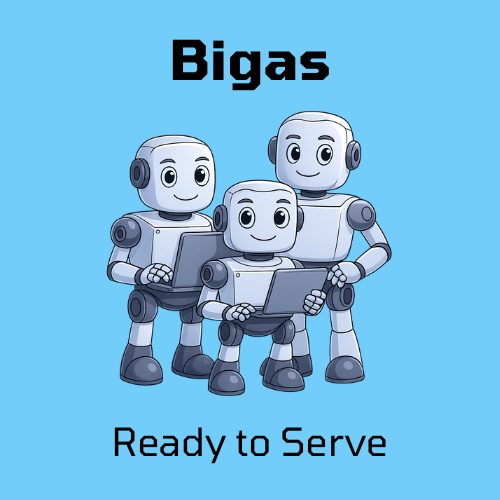

# 🚀 Bigas - AI-Powered Marketing Analytics Platform

[](https://www.python.org/downloads/)
[](https://flask.palletsprojects.com/)
[](https://developers.google.com/analytics/devguides/reporting/data/v1)
[](https://platform.openai.com/docs)
[](https://modelcontextprotocol.io/)

<div align="center">
  
  <br/>
  <strong>Automated weekly analytics reports with AI-powered insights for solo founders</strong>
</div>

## 📱 Stay Updated

Follow us on X for the latest updates, feature announcements, and marketing insights:
**[@bigasmyaiteam](https://x.com/bigasmyaiteam)**

## 📊 Overview

**Bigas** is an AI team concept designed to provide virtual specialists for different business functions. We've started with our first virtual team member: **The Marketing Specialist**.

### 🎯 Our Goal
To build a comprehensive AI team that can handle various business functions, starting with marketing and expanding to other areas like sales, customer support, product development, and more.

### 🚀 Current Implementation: Virtual Marketing Specialist

Bigas is now an **AI-powered marketing analytics platform** that automatically generates comprehensive weekly reports with actionable insights. It combines Google Analytics 4 data with OpenAI's GPT-4 to provide intelligent marketing recommendations.

**What our Virtual Marketing Specialist does:**
- 📈 **Weekly Analytics Reports**: Automated GA4 analysis with AI-powered insights
- 🔍 **Page Performance Analysis**: Identifies underperforming pages with high traffic but low conversions
- 🎯 **Expert Recommendations**: Provides specific, actionable improvement suggestions based on actual page content
- 📊 **Discord Integration**: Posts detailed reports and analysis directly to your Discord channel
- 🗄️ **Data Storage**: Stores reports in Google Cloud Storage for historical analysis

### Key Features
- 🤖 **AI-Powered Analysis**: Get intelligent insights, not just raw data
- 📅 **Automated Weekly Reports**: Set up once, get reports every Monday
- 🔗 **URL Extraction**: Automatically extracts actual page URLs from GA4 data
- 💾 **Smart Storage**: Stores reports in Google Cloud Storage for analysis
- 🎯 **Actionable Insights**: Specific improvement suggestions with priority rankings
- 🌐 **Page Content Analysis**: Web scraping to analyze actual page content and provide concrete suggestions
- 💰 **Cost-Effective**: Minimal storage and API costs (<$0.10/month)

## 🔌 Model Context Protocol (MCP) Integration

**✅ Fully MCP 2025 Compliant Server** - Ready for AI client integration

Bigas Core implements the [Model Context Protocol (MCP)](https://modelcontextprotocol.io/) specification, making it compatible with MCP-enabled AI clients like Claude and other LLM applications.

### MCP Configuration

```json
{
    "manifestUrl": "https://mcp-marketing-919623369853.europe-north1.run.app/mcp/manifest",
    "openapiUrl": "https://mcp-marketing-919623369853.europe-north1.run.app/openapi.json"
}
```

### MCP Features
- **10 MCP Tools**: Complete analytics toolkit accessible via natural language
- **JSON-RPC 2.0**: Standard MCP transport protocol
- **Secure HTTPS**: Production-ready with proper authentication
- **Tool Categories**: Analytics queries, report generation, storage management, page optimization

### Quick MCP Integration
1. Add the above configuration to your MCP client
2. Access tools via natural language: *"Generate a weekly analytics report"*
3. Get structured responses with actionable insights
4. Integrate seamlessly with your existing AI workflows

## 🏗️ Architecture

Bigas is built as a **Modular Monolith** with a service-oriented architecture:

```text
+--------------------------+
|         Clients          |
|  - Manual User (curl)    |
|  - Google Cloud Scheduler|
|  - MCP AI Clients        |
+--------------------------+
             |
             v
+--------------------------+
|   Google Cloud Run       |
|  (Hosting Environment)   |
+--------------------------+
             |
             v
+-------------------------------------------------+
|  Bigas Platform (app.py - Flask App)            |
|                                                 |
| +---------------------------------------------+ |
| | API Gateway / Router                        | |
| +---------------------------------------------+ |
|   |                      |                      |
|   | (/marketing/*)       | (/product/*)         |
|   v                      v                      |
| +----------------------+ +--------------------+ |
| | Marketing Resource   | | Product Resource   | |
| | (Connects to GA,     | | (Placeholder for   | |
| |  OpenAI, Discord,    | |  Jira, Figma, etc) | |
| |  Google Cloud Storage)| |                    | |
| +----------------------+ +--------------------+ |
|                                                 |
+-------------------------------------------------+
```

### Service Layer

The marketing analytics functionality is organized into focused services:

- **`GA4Service`**: Handles Google Analytics 4 API interactions
- **`OpenAIService`**: Manages OpenAI API calls for analysis and summarization
- **`TemplateService`**: Provides template-driven analytics queries
- **`TrendAnalysisService`**: Orchestrates trend analysis workflows
- **`StorageService`**: Manages weekly report storage in Google Cloud Storage
- **`EnhancedAIService`**: Generates structured recommendations with industry benchmarks

### Data Flow

1. **Weekly Reports**: Generated and stored in Google Cloud Storage
2. **Analysis Jobs**: Retrieve stored reports to analyze underperforming pages
3. **AI Insights**: Generate improvement suggestions using OpenAI
4. **Discord Integration**: Post results to Discord for easy access
5. **Storage Management**: Automatic cleanup of old reports to manage costs

## 🚀 Quick Start

### 1. Prerequisites Setup

#### Google Cloud Setup
1. **Create a Google Cloud Project**
   ```bash
   gcloud projects create your-project-id
   gcloud config set project your-project-id
   ```

2. **Enable Required APIs**
   ```bash
   gcloud services enable analyticsdata.googleapis.com
   gcloud services enable run.googleapis.com
   gcloud services enable storage.googleapis.com
   ```

3. **Create Service Account**
   ```bash
   gcloud iam service-accounts create bigas-analytics \
     --display-name="Bigas Analytics Service Account"
   
   gcloud projects add-iam-policy-binding your-project-id \
     --member="serviceAccount:bigas-analytics@your-project-id.iam.gserviceaccount.com" \
     --role="roles/analytics.dataViewer"
   
   gcloud projects add-iam-policy-binding your-project-id \
     --member="serviceAccount:bigas-analytics@your-project-id.iam.gserviceaccount.com" \
     --role="roles/storage.admin"
   ```

4. **Download Service Account Key**
   ```bash
   gcloud iam service-accounts keys create bigas-service-account.json \
     --iam-account=bigas-analytics@your-project-id.iam.gserviceaccount.com
   ```

#### Google Analytics 4 Setup
1. **Get your GA4 Property ID**
   - Go to [Google Analytics](https://analytics.google.com/)
   - Select your property
   - Go to Admin → Property Settings
   - Copy the Property ID (format: 123456789)

2. **Ensure Data API is enabled**
   - Go to Admin → Data Streams
   - Select your web stream
   - Ensure "Google Analytics Data API" is enabled

#### OpenAI Setup
1. **Get your OpenAI API Key**
   - Go to [OpenAI Platform](https://platform.openai.com/)
   - Navigate to API Keys
   - Create a new secret key
   - Copy the key (starts with `sk-`)

### 2. Environment Configuration

Create a `.env` file in the project root:

```bash
# Google Analytics 4
GA4_PROPERTY_ID=your_ga4_property_id

# OpenAI
OPENAI_API_KEY=your_openai_api_key

# Discord (Optional)
DISCORD_WEBHOOK_URL=your_discord_webhook_url

# Google Cloud
GOOGLE_PROJECT_ID=your_project_id
GOOGLE_SERVICE_ACCOUNT_EMAIL=bigas-analytics@your_project_id.iam.gserviceaccount.com
STORAGE_BUCKET_NAME=your_storage_bucket_name

# Target Keywords (Optional)
TARGET_KEYWORDS=sustainable_swag:eco_friendly_promotional_clothing:eco_friendly_swag
```

### 3. Installation

```bash
# Clone the repository
git clone https://github.com/mckort/bigas.git
cd bigas

# Create virtual environment
python -m venv venv
source venv/bin/activate  # On Windows: venv\Scripts\activate

# Install dependencies
pip install -r requirements.txt
```

### 4. Local Development

```bash
# Run the application
python app.py

# The server will start on http://localhost:5000
```

### 5. Production Deployment

```bash
# Deploy to Google Cloud Run
./deploy.sh
```

## 📚 API Reference

### MCP Endpoints

| Endpoint | Method | Description | Function |
|----------|--------|-------------|----------|
| `/mcp/tools/weekly_analytics_report` | POST | Generate comprehensive weekly report | `weekly_analytics_report()` |
| `/mcp/tools/ask_analytics_question` | POST | Ask specific analytics questions | `ask_analytics_question()` |
| `/mcp/tools/analyze_trends` | POST | Trend analysis with AI insights | `analyze_trends()` |
| `/mcp/tools/fetch_custom_report` | POST | Custom GA4 report generation | `fetch_custom_report()` |
| `/mcp/tools/analyze_underperforming_pages` | POST | Deep analysis of underperforming pages | `analyze_underperforming_pages()` |
| `/mcp/tools/get_stored_reports` | GET | List all stored weekly reports | `get_stored_reports()` |
| `/mcp/tools/get_latest_report` | GET | Retrieve most recent weekly report | `get_latest_report()` |
| `/mcp/tools/cleanup_old_reports` | POST | Clean up old stored reports | `cleanup_old_reports()` |

### System Endpoints

| Endpoint | Method | Description | Function |
|----------|--------|-------------|----------|
| `/mcp/manifest` | GET | Combined MCP manifest | `combined_manifest()` |
| `/openapi.json` | GET | OpenAPI specification | `openapi_spec()` |

### Product Management Endpoints

| Endpoint | Method | Description | Function |
|----------|--------|-------------|----------|
| `/mcp/tools/product_resource_placeholder` | POST | Placeholder for future product management features | `product_placeholder()` |

## 🧪 Testing

### Test Storage Functionality
```bash
python tests/test_storage.py
```

### Test Domain Extraction
```bash
python tests/test_domain_extraction.py
```

### Test Health Check
```bash
python tests/health_check.py
```

### Running All Tests
```bash
# Core functionality tests
python tests/test_storage.py
python tests/test_domain_extraction.py

# Health check
python tests/health_check.py

# Integration tests
python tests/test_client.py
```

### Available Test Modules
- `test_storage.py`: Google Cloud Storage integration testing
- `test_domain_extraction.py`: Domain and URL processing validation
- `test_client.py`: API endpoint integration testing
- `health_check.py`: System health validation
- `auto_fix_test_runner.py`: Automated test execution with fixes

## 🔒 Security

### Critical Security Requirements

#### 1. Environment Variables
**NEVER commit sensitive data to version control!**

All sensitive information must be stored as environment variables:
- `GA4_PROPERTY_ID` - Google Analytics 4 Property ID
- `OPENAI_API_KEY` - OpenAI API key
- `DISCORD_WEBHOOK_URL` - Discord webhook URL (optional)
- `GOOGLE_PROJECT_ID` - Google Cloud Project ID
- `GOOGLE_SERVICE_ACCOUNT_EMAIL` - Service account email
- `STORAGE_BUCKET_NAME` - Google Cloud Storage bucket (optional)

#### 2. File Security
- ✅ `.env` files are in `.gitignore`
- ✅ No hardcoded secrets in scripts
- ✅ Service account JSON files are excluded
- ✅ API keys are never logged

#### 3. Access Control
- ✅ Service accounts have minimal required permissions
- ✅ API keys have appropriate scopes
- ✅ HTTPS for all external communications
- ✅ Regular key rotation

### Security Checklist

#### Before Committing Code
- No API keys in code
- No hardcoded credentials
- No sensitive URLs in comments
- `.env` file is not tracked
- Service account files are excluded

#### Before Deployment
- Environment variables are set
- Service account has correct permissions
- API keys are valid and active
- HTTPS is used for webhooks
- Logging excludes sensitive data

#### Regular Maintenance
- Rotate API keys quarterly
- Review service account permissions
- Monitor API usage and costs
- Update dependencies for security patches
- Audit access logs

### Security Features

#### Input Validation ✅
- All API endpoints validate input parameters
- Date ranges are validated for logical consistency (start before end, not in future, max 2 years)
- Metric/dimension combinations are verified for GA4 compatibility
- Request data size limits (max 10KB per request)
- URL format validation for web scraping
- Content size limits (max 5MB for page analysis)

#### Error Handling ✅
- Sensitive information is never exposed in error messages
- API keys and webhook URLs are automatically redacted
- Graceful degradation when services are unavailable
- Proper HTTP status codes for different error types (400, 404, 429, 500)

#### Rate Limiting ✅
- Simple in-memory rate limiting (100 requests per hour per endpoint)
- Automatic cleanup of old rate limit entries
- HTTP 429 status code for rate limit exceeded
- Per-endpoint rate limiting to prevent abuse

#### Request Validation ✅
- JSON request validation
- Required field checking
- Input sanitization
- Size and length limits
- URL security checks

### Incident Response

#### If API Keys are Compromised
1. **Immediately rotate the compromised key**
2. **Check for unauthorized usage**
3. **Review access logs**
4. **Update all environment variables**
5. **Notify relevant stakeholders**

#### If Service Account is Compromised
1. **Disable the service account**
2. **Create a new service account**
3. **Update permissions and environment variables**
4. **Review all access logs**
5. **Audit all resources accessed**

### Security Tools

#### Recommended Tools
- **GitGuardian** - Detect secrets in code
- **Snyk** - Dependency vulnerability scanning
- **Google Cloud Security Command Center** - Cloud security monitoring

#### Code Scanning
```bash
# Check for secrets in code
grep -r "sk-" . --exclude-dir=venv
grep -r "AIza" . --exclude-dir=venv
grep -r "discord.com/api/webhooks" . --exclude-dir=venv
```

## 🤝 Contributing

We welcome contributions! Please see our Contributing Guide for details.

### Development Setup
1. **Clone the repository**
   ```bash
   git clone https://github.com/mckort/bigas.git
   cd bigas
   ```

2. **Set up virtual environment**
   ```bash
   python -m venv venv
   source venv/bin/activate  # On Windows: venv\Scripts\activate
   pip install -r requirements.txt
   pip install -r requirements-dev.txt
   ```

3. **Configure environment**
   ```bash
   cp env.example .env
   # Edit .env with your actual values
   ```

4. **Run tests**
   ```bash
   python tests/test_storage.py
   python tests/test_domain_extraction.py
   ```

## 📞 Support

For support:
1. Check the Issues page
2. Create a new issue with detailed information
3. Include your environment setup and error messages

### Security Issues
For security issues:
1. **Do not create public issues** for security problems
2. **Contact the maintainer directly** with security concerns
3. **Include detailed information** about the security issue
4. **Provide steps to reproduce** if applicable

## 📄 License

This project is licensed under the MIT License - see the LICENSE file for details.

## 🔄 Changelog

### v1.2.0
- ✅ Added web scraping functionality for page content analysis
- ✅ Enhanced underperforming pages analysis with actual page content
- ✅ Improved Discord messaging with one message per page
- ✅ Added specific, actionable suggestions based on real page structure
- ✅ Implemented page content analysis (CTAs, forms, headings, etc.)

### v1.1.0
- ✅ Added Google Cloud Storage integration
- ✅ Implemented URL extraction from GA4 data
- ✅ Added underperforming pages analysis
- ✅ Enhanced AI-powered improvement suggestions
- ✅ Added automatic domain detection from GA4

### v1.0.0
- ✅ Initial release with weekly analytics reports
- ✅ Discord integration
- ✅ Google Analytics 4 integration
- ✅ OpenAI-powered insights

---

**Built with ❤️ for solo founders who need actionable marketing insights**

## About

Bigas means team in latin. The purpose of this open source project is to create a virtual team of resources to assist solo founders. The resources could be any, starting with marketing. The intent is to keep it simple, for non-professional developers to be able to contribute.

### Resources
- Readme
- Contributing

---

**Version**: 1.2  
**Last Updated**: September 2025  
**Compatibility**: Google Analytics 4, OpenAI GPT-4, Python 3.11+, MCP 2025