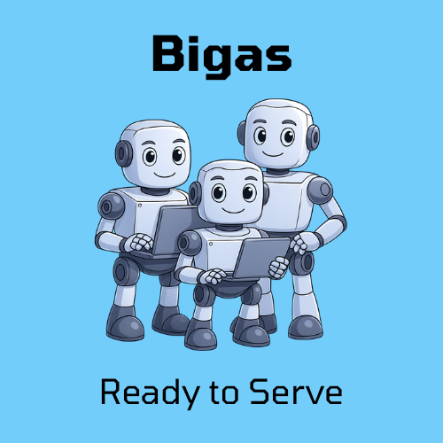
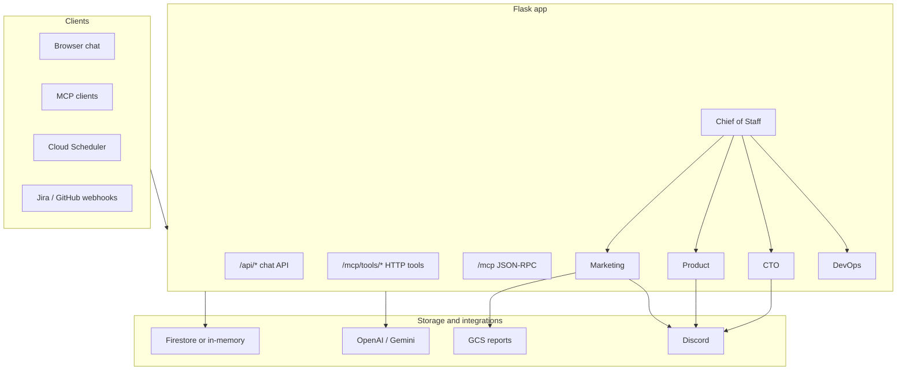

# Bigas — Modular MCP Server for Your Virtual AI Team

<div align="center">
  
  <br/>
  <strong>A brand-aligned web chat with your virtual AI team — plus marketing analytics, Jira AI workflows, release notes, CTO code review, and DevOps deployments.</strong>
</div>

Follow us on X: **[@bigasmyaiteam](https://x.com/bigasmyaiteam)**

---

## Table of contents

- [MVP Quickstart (under 5 minutes)](#mvp-quickstart-under-5-minutes)
- [Solo Founder Playbooks](#solo-founder-playbooks)
- [What is Bigas?](#what-is-bigas)
- [Why Google Cloud Run?](#why-google-cloud-run)
- [Tutorial: deploy your first Bigas server](#tutorial-deploy-your-first-bigas-server)
- [Environment variables](#environment-variables)
- [GA4 setup](#ga4-setup)
- [Walkthrough: from Jira card to merged PR](#walkthrough-from-jira-card-to-merged-pr)
- [Walkthrough: from PR to ready to merge](#walkthrough-from-pr-to-ready-to-merge)
- [Walkthrough: from chat to production deploy](#walkthrough-from-chat-to-production-deploy)
- [MCP endpoint](#mcp-endpoint)
- [Chat web interface](#chat-web-interface)
- [API reference](#api-reference)
- [Automating reports with Cloud Scheduler](#automating-reports-with-cloud-scheduler)
- [Architecture](#architecture)
- [Local development](#local-development)
- [Security](#security)
- [Contributing](#contributing)
- [License](#license)

---

## MVP Quickstart (under 5 minutes)

Try Bigas locally with **only an LLM API key** — no Google Cloud, Firebase, or Discord required.

```bash
git clone https://github.com/mckort/bigas.git
cd bigas
python scripts/setup.py          # interactive wizard → writes .env
docker compose up --build        # or: pip install -r requirements.txt && python run_core.py
```

Open **http://localhost:8080**, sign in with any email and dev token **`bigas-dev-token`**.

The setup wizard configures:

| Setting | Value | Why |
|---|---|---|
| `CHAT_STORAGE_MODE` | `memory` | No Firestore — chat history stays in-process |
| `CHAT_AUTH_MODE` | `dev` | No Firebase — use the dev token above |
| `CHAT_ENABLED` | `true` | Web chat UI at `/` |
| LLM key | Gemini or OpenAI | Required — powers all agents |

Optional integrations (GitHub, Jira, GA4, Discord) are offered during setup; skip them to explore the chat UI first. Re-run `python scripts/setup.py` anytime to add specialists.

**Without Docker:** after `python scripts/setup.py`, build the frontend once (`cd frontend && npm install && npm run build && cd ..`), then `python run_core.py`.

For production on Google Cloud Run, see [Tutorial: deploy your first Bigas server](#tutorial-deploy-your-first-bigas-server).

---

## Solo Founder Playbooks

Concrete workflows for founders juggling dev, maintenance, and distribution across multiple projects.

### Playbook 1: The Dev-Marketer

**Stack:** Jira + GitHub + X  
**Goal:** Ship features *and* tell people about them without context-switching.

1. Drag a Jira card to **Done** → Bigas posts a team progress update (Product agent).
2. Set a **Fix Version** on release issues → Bigas generates release notes and a blog/social draft.
3. Ask in chat: *"Draft a tweet about this week's shipped work"* → edit and approve from the Product thread.
4. Optional: weekly git activity → X draft with Discord approve/decline links.

**Minimum env:** LLM key and `GITHUB_TOKEN` for AI implement columns. The **native Kanban board** (no `JIRA_*` required) is the default when Jira is not configured; connect external Jira optionally for existing boards.

### Playbook 2: The Agency Owner

**Stack:** GA4 + Google/Meta/LinkedIn/Reddit Ads + Discord  
**Goal:** One weekly view of traffic and ad spend across client sites.

1. Schedule `weekly_analytics_report` and portfolio reports via Cloud Scheduler (or ask in chat).
2. Ask: *"Run a cross-platform marketing analysis"* → budget comparison across ad platforms.
3. Reports land in Discord **and** the Marketing Analyst chat thread for async review.

**Minimum env:** `GA4_PROPERTY_ID`, `GOOGLE_PROJECT_ID`, ad platform tokens, `DISCORD_WEBHOOK_URL_MARKETING`.

### Playbook 3: The Solo CTO

**Stack:** GitHub + Cursor  
**Goal:** Keep code quality up while you build the next feature.

1. Open a PR → call `review_and_comment_pr` (or ask the CTO agent in chat).
2. Bigas reads the diff, posts an architecture-focused review comment on the PR.
3. Failed CI? Self-healing workflow opens a hotfix PR; optional Cursor autofix for deeper fixes.
4. Ask: *"Summarize my open PRs and flag blockers"* from the CTO thread.

**Minimum env:** `GITHUB_TOKEN`, LLM key. Add `CURSOR_API_KEY` for autonomous autofix.

---


## What is Bigas?

**Bigas** (Latin for *team*) is an open-source MCP server that gives a solo founder or small team a virtual staff across **marketing, product, and engineering** — without hiring anyone.

It currently ships five specialists, reachable from the **[web chat](#chat-web-interface)** at `/` (Chief of Staff by default, or talk to any specialist directly):

| Specialist | What it does |
|---|---|
| **Chief of Staff** | Default chat agent across the whole Jira/GitHub portfolio: answers general questions, delegates to Marketing / Product / CTO / DevOps, can file Jira Task/Bug issues, and monitors progress |
| **Senior Marketing Analyst** | GA4 web analytics (per site via `BIGAS_GA4_PROPERTY_MAP`) + paid ads (Google Ads, Meta, LinkedIn, Reddit) → weekly reports, portfolio reports, cross-platform budget analysis; can file marketing Jira issues |
| **Product Manager** | Jira board automation — AI research and design when you drag a card, Fix Version → release notes + blog/social, Done issues → team progress updates, weekly git activity → X post drafts with Discord approval; can create Jira Task/Bug issues |
| **CTO** | GitHub PR diff → AI code review comment posted directly to the PR (optional autofix via Cursor cloud agents); website uptime/SSL monitoring → Discord; can file Jira follow-ups |
| **DevOps** | Pre-flight deployment risk checks (migrations, config), trigger GitHub Actions deploy workflows (e.g. separate backend + web for vcfieldassistant), post-deploy HTTP health checks, **self-healing CI/CD** (failed workflow_run webhook → log analysis → hotfix PR on `bigas-hotfix/*`); can file Jira follow-ups |

Two design decisions shape everything else in this document:

1. **It's opinionated, out of the box.** Bigas assumes Google Cloud (Cloud Run, GA4, GCS, Cloud Scheduler, Firebase Auth, Firestore), Discord, and Jira/GitHub, so a new deployment has almost nothing to decide — just fill in `.env` and run `./deploy.sh`. Nothing here is required to use *those specific* products elsewhere: the Flask app is a normal container that runs anywhere Docker runs, and the [provider architecture](#modular-architecture-providers) lets you swap or add data sources without touching existing code.
2. **It's modular.** Marketing, Product, CTO, and DevOps are independent resource packages. Ads/finance/analytics/notification integrations are *providers* discovered at startup — enable one by setting its env vars, add a new one (e.g. TikTok Ads, QuickBooks, Slack) by dropping in a file, no core changes required. See [Modular architecture: providers](#modular-architecture-providers).

Bigas talks to your data sources, does the analysis with an LLM (OpenAI or Gemini), and pushes results to Discord. When the agent chat UI is enabled, the same output also lands in the matching specialist thread and the activity feed. You can call any tool directly over HTTP, from any MCP client (Claude, Cursor, etc.), or on a schedule via Cloud Scheduler. Chat is optional: Firebase Auth and Firestore are only for persistent production chat — run without them via in-memory storage locally, or set `CHAT_ENABLED=false` for Discord/MCP only. When chat is on, open the deployed Cloud Run URL in a browser to use the UI.

---

## Why Google Cloud Run?

Bigas is built to sit mostly idle and burst occasionally: a weekly analytics report, a Jira card being dragged across a board a few times a day, an occasional PR review. That usage pattern is exactly what **Cloud Run** is priced for:

- **Scale to zero.** `deploy.sh` doesn't set `--min-instances`, so Cloud Run defaults to zero — you pay nothing while no request is in flight. There's no server running 24/7 waiting for the next Jira webhook.
- **Pay only for actual request time**, billed per-request in fractions of a second of CPU/memory, not per hour of a reserved VM. A founder running weekly reports and a handful of Jira/PR events a day typically stays inside Cloud Run's free tier or a few dollars a month.
- **One container image, one `gcloud run deploy`.** No cluster, no VM patching, no load balancer to configure — `deploy.sh` builds the image, pushes it to Artifact Registry, and deploys it in one shot.
- **Fits natively with the rest of the stack**: Cloud Scheduler triggers HTTP endpoints on a cron, Secret Manager can feed env vars at startup (`SECRET_MANAGER=true`), and GCS stores reports — all billed the same pay-per-use way.

None of this is required — the Flask app runs equally well on Fly.io, Render, a VPS, or your laptop via `python run_core.py`. Persistent chat history needs Firestore; locally you can use in-memory storage, or disable chat with `CHAT_ENABLED=false`. Everything else can stay stateless. Cloud Run is simply the path this project is opinionated and tested toward, because for the "one founder, spiky traffic" use case it tends to be the cheapest place to run it.

---

## Tutorial: deploy your first Bigas server

This walks through a real first deploy, end to end, using `acme-bigas` as a stand-in for your Google Cloud project ID — swap it for your own throughout.

### 1. Prerequisites

- [`gcloud` CLI](https://cloud.google.com/sdk/docs/install) installed and authenticated (`gcloud auth login`)
- Docker installed and running locally (`deploy.sh` builds the image on your machine and pushes it)
- A Google Cloud project (`gcloud projects create acme-bigas` if you don't have one yet)

### 2. Enable the APIs and create the plumbing

```bash
gcloud config set project acme-bigas

# APIs Bigas needs
gcloud services enable run.googleapis.com \
  analyticsdata.googleapis.com \
  artifactregistry.googleapis.com \
  storage.googleapis.com \
  secretmanager.googleapis.com \
  firestore.googleapis.com \
  identitytoolkit.googleapis.com

# Artifact Registry repo that deploy.sh pushes images to (region must match deploy.sh: europe-north1)
gcloud artifacts repositories create bigas-repo \
  --repository-format=docker --location=europe-north1
gcloud auth configure-docker europe-north1-docker.pkg.dev

# Runtime service account
gcloud iam service-accounts create bigas-runner \
  --display-name="Bigas Cloud Run runtime"

# Minimal roles — see the table below for why each is needed
gcloud projects add-iam-policy-binding acme-bigas \
  --member="serviceAccount:bigas-runner@acme-bigas.iam.gserviceaccount.com" \
  --role="roles/analyticsdata.reader"
gcloud projects add-iam-policy-binding acme-bigas \
  --member="serviceAccount:bigas-runner@acme-bigas.iam.gserviceaccount.com" \
  --role="roles/storage.objectAdmin"
gcloud projects add-iam-policy-binding acme-bigas \
  --member="serviceAccount:bigas-runner@acme-bigas.iam.gserviceaccount.com" \
  --role="roles/datastore.user"
```

| Role | Why the runtime service account needs it |
|---|---|
| `roles/analyticsdata.reader` | Read from the GA4 Data API |
| `roles/storage.objectAdmin` | Read/write/delete reports in the GCS bucket |
| `roles/datastore.user` | Read/write chat history in Firestore (needed when `CHAT_STORAGE_MODE=firestore`) |
| `roles/secretmanager.secretAccessor` | **Only if** you set `SECRET_MANAGER=true` to load env vars from Secret Manager at startup |

You (or your CI account) also need permission to *deploy* — typically `roles/run.admin` and `roles/iam.serviceAccountUser` on `bigas-runner`, granted to your own user or CI service account.

### 3. Configure environment variables

```bash
git clone https://github.com/mckort/bigas.git
cd bigas
cp env.example .env.acme-bigas
ln -sfn .env.acme-bigas .env
```

Edit `.env` and fill in, at minimum:

```bash
GOOGLE_PROJECT_ID=acme-bigas
GOOGLE_SERVICE_ACCOUNT_EMAIL=bigas-runner@acme-bigas.iam.gserviceaccount.com
GA4_PROPERTY_ID=123456789
GEMINI_API_KEY=your_gemini_api_key           # or OPENAI_API_KEY
DOCKER_REPO=bigas-repo
IMAGE_NAME=bigas
IMAGE_TAG=latest
```

See [Environment variables](#environment-variables) for the full list — Discord, Jira, GitHub, and ads platforms are all optional and only needed for the specialists you want to use.

### 4. Deploy

```bash
./deploy.sh
```

This builds the Docker image, pushes it to Artifact Registry, and runs `gcloud run deploy`. On success it prints your service URL.

### 5. Run your first report

```bash
curl -X POST https://your-service-url.a.run.app/mcp/tools/weekly_analytics_report
```

If `DISCORD_WEBHOOK_URL_MARKETING` is set, the report is posted to your Discord marketing channel. Try a second one to see the LLM answer an ad-hoc question against your live GA4 data:

```bash
curl -X POST https://your-service-url.a.run.app/mcp/tools/ask_analytics_question \
  -H "Content-Type: application/json" \
  -d '{"question": "Which country had the most active users last week?", "project_key": "GPWW"}'
```

From here: wire up [Jira automation](#walkthrough-from-jira-card-to-merged-pr) for the Product/CTO specialists, or [Cloud Scheduler](#automating-reports-with-cloud-scheduler) to run reports on a cadence instead of by hand.

---

## Environment variables

**Required (core):**

| Variable | Description |
|---|---|
| `GA4_PROPERTY_ID` | Default Google Analytics 4 property ID (Admin → Property Details). Used when no project is named. |
| `GOOGLE_PROJECT_ID` | Google Cloud project ID |
| `GOOGLE_SERVICE_ACCOUNT_EMAIL` | Service account email |

**LLM (at least one provider required):**

| Variable | Description |
|---|---|
| `GEMINI_API_KEY` | Gemini API key — **default LLM**; used when `LLM_MODEL` is unset or starts with `gemini-` |
| `OPENAI_API_KEY` | OpenAI API key — alternative; used when `LLM_MODEL` starts with `gpt-` |
| `LLM_MODEL` | Global default model; defaults to `gemini-3.1-pro-preview` if unset |

**Optional:**

| Variable | Description |
|---|---|
| `DISCORD_WEBHOOK_URL_MARKETING` | Discord webhook for marketing reports |
| `DISCORD_WEBHOOK_URL_PRODUCT` | Discord webhook for release notes, progress updates, and Jira AI research notifications |
| `DISCORD_WEBHOOK_URL_CTO` | Discord webhook for PR review / engineering notifications |
| `STORAGE_BUCKET_NAME` | GCS bucket for report storage (default: `bigas-analytics-reports`) |
| `TARGET_KEYWORDS` | Colon-separated keywords for SEO analysis (e.g. `sustainable_swag:eco_friendly_clothing`) |
| `JIRA_BASE_URL` | Jira instance URL (optional — omit to use the native Kanban board at `/board`) |
| `JIRA_EMAIL` | Jira account email |
| `JIRA_API_TOKEN` | Jira API token |
| `JIRA_PROJECT_KEY` | Jira project key(s), comma-separated for the whole portfolio (e.g. `VFA,WAYW,BIG,REM,GPWW,FYDA,MYL`). Per-request override via `project_key` / `project_keys`. With `SECRET_MANAGER=true`, update this secret — Cloud Run env is overwritten at startup. |
| `USE_INTERNAL_BOARD` | `true` (default when Jira is unset) uses the native board; set `false` to require external Jira |
| `BIGAS_GA4_PROPERTY_MAP` | Optional `KEY:propertyId` map (comma-separated), e.g. `GPWW:473559548`. Chat/`ask_analytics_question` uses this per site. Unmapped projects return an error instead of querying another brand. |
| `JIRA_AUTOMATION_WEBHOOK_SECRET` | Shared secret for `jira_status_automation` (header `X-Bigas-Webhook-Secret`). Full setup: [docs/jira-automation.md](docs/jira-automation.md) |
| `GITHUB_TOKEN` | GitHub token — PR review, Jira AI repo context, DevOps workflow dispatch (needs Actions write), and self-healing CI PR creation |
| `GITHUB_WEBHOOK_SECRET` | Shared secret for GitHub `workflow_run` webhooks (`X-Hub-Signature-256`). Falls back to `JIRA_AUTOMATION_WEBHOOK_SECRET` if unset |
| `ENABLE_SELF_HEALING_CI` | When `true` (default), process failed GitHub Actions runs and open hotfix PRs. Set `false` to disable |
| `BIGAS_CI_LOG_ZIP_MAX_BYTES` | Max workflow run log zip size to download (default 52428800 = 50 MB). Larger zips fall back to per-job log API |
| `BIGAS_DEPLOY_WORKFLOW_MAP` | Optional `PROJECT:file.yml,file.yml` map (pipe between projects), e.g. `VFA:deploy-backend.yml,deploy-web.yml`. Workflows are dispatched on the product repo unless `BIGAS_DEPLOY_REPO_MAP` overrides it. Unset = VFA default |
| `BIGAS_DEPLOY_REPO_MAP` | Optional `KEY:owner/repo` CSV. When set, `trigger_deployment` dispatches workflows on that repo instead of `BIGAS_JIRA_PROJECT_REPO_MAP`. Risk checks still compare the product repo. Used for VM sites (`mckort/gcp-single-vm-webstack`). |
| `X_ACCOUNTS` | Comma-separated X handles for weekly community posts (optional). Credentials via `X_CREDENTIALS_JSON` (recommended for Secret Manager) or `X_API_KEY` / `X_ACCESS_TOKEN_<ACCOUNT>` |
| `X_POST_SIGNING_SECRET` | HMAC secret for Approve/Decline links. Falls back to `JIRA_AUTOMATION_WEBHOOK_SECRET` |
| `SERVER_URL` | Public Cloud Run URL (tests + Discord X-post approval links). `deploy.sh` injects it; not a secret |
| `MONITOR_URLS` | Comma-separated list of URLs to monitor (e.g. `https://site1.com,https://site2.com`) |
| `LINKEDIN_AD_ACCOUNT_URN` | Default LinkedIn ad account URN |
| `REDDIT_AD_ACCOUNT_ID` | Default Reddit ad account ID |
| `CHAT_ENABLED` | Enable web chat UI and API (default: `true`) |
| `CHAT_AUTH_MODE` | `dev` (local token) or `firebase` (Firebase Auth JWT) |
| `CHAT_STORAGE_MODE` | `memory` (local) or `firestore` (production) |
| `CHAT_ALLOWED_EMAILS` | Comma-separated emails allowed to use chat in Firebase mode. Set to `*` to allow any Firebase user while keeping `CHAT_ADMIN_EMAILS` for admin-only actions. Falls back to `CHAT_ADMIN_EMAILS` if unset. Empty both = any Firebase user. |
| `CHAT_ADMIN_EMAILS` | Comma-separated emails allowed to update global agent configs (defaults to `dev@bigas.local` in dev auth mode) |
| `FIREBASE_PROJECT_ID` | Firebase/GCP project for Auth + Firestore (often the same as `GOOGLE_PROJECT_ID`) |
| `FIREBASE_WEB_API_KEY` | Firebase **web** API key (public client key; also exposed via `GET /api/auth/config`) |
| `VITE_FIREBASE_API_KEY` | Same web API key — required at `./deploy.sh` Docker build time |
| `VITE_FIREBASE_AUTH_DOMAIN` | e.g. `your-project.firebaseapp.com`. **Required** in production (`/api/auth/config` has no fallback without the `VITE_` prefix) |
| `VITE_FIREBASE_PROJECT_ID` | Same as `FIREBASE_PROJECT_ID`; Docker build-arg |
| `BIGAS_CHAT_MODEL` | LLM model for chat / Chief of Staff (defaults to `LLM_MODEL`) |
| `BIGAS_EMAIL_IMAP_SERVER` | IMAP host for Chief of Staff inbox (e.g. `imap.migadu.com` for Migadu). In production, load via Secret Manager. |
| `BIGAS_EMAIL_USERNAME` | IMAP login (e.g. `cos@bigas.me`). In production, load via Secret Manager. |
| `BIGAS_EMAIL_PASSWORD` | IMAP password. Store in Secret Manager; do not put it in Cloud Run env. |
| `BIGAS_EMAIL_SMTP_SERVER` | SMTP host for sending COS replies (default `smtp.migadu.com`) |
| `BIGAS_EMAIL_SMTP_PORT` | SMTP port (default `465`) |
| `BIGAS_EMAIL_SYNC_USER_EMAIL` | Chat user email that receives overnight email triage (defaults to first `CHAT_ADMIN_EMAILS`) |
| `BIGAS_EMAIL_MAX_BODY_CHARS` | Max plain-text email body passed to the COS LLM (default `8000`) |

Per-feature model overrides: `BIGAS_MARKETING_LLM_MODEL`, `BIGAS_RELEASE_NOTES_MODEL`, `BIGAS_PROGRESS_UPDATES_MODEL`, `BIGAS_CTO_PR_REVIEW_MODEL`, `BIGAS_JIRA_RESEARCH_MODEL`, `BIGAS_CHAT_MODEL`. See `env.example` and `bigas/llm/README.md`.

---

## GA4 setup

1. Go to **Google Analytics → Admin → Property Access Management**
2. Add your service account email with the **Marketer** role
3. Copy your **Property ID** (Admin → Property Details) into `GA4_PROPERTY_ID` (default / fallback) and, for multiple sites, `BIGAS_GA4_PROPERTY_MAP=GPWW:123456789,VFA:987654321`

> If you get a 403 error, wait a few minutes for permissions to propagate.

---

## Walkthrough: from Jira card to merged PR

This is the flow that makes the **Product Manager** and **CTO** specialists work together: dragging a Jira card triggers AI research, then AI design, then an AI-implemented pull request — with a human approval gate between every AI step.

Say you write a card with just a **Brief** — a couple of sentences on what you want and why — and drag it into the first AI column.

**Tasks / Bugs / Stories** use this implement-a-PR loop:

1. **`Research and describe (AI)`** — Bigas reads the Brief, researches the codebase/context, and writes an **AI Research** section onto the issue (your Brief is left untouched). The card moves itself to **Description approval (manual)** and posts to your `bigas-pm` Discord channel and the Product Manager chat. You read the research, edit if needed, and drag the card forward yourself.
2. **`Design and plan (AI)`** — Bigas reads Brief + Research + repo context and writes an **AI Plan**: the concrete implementation approach. Moves to **Design approval (manual)**, posts to `bigas-cto` and the CTO chat. Again, a human reviews and approves by dragging the card.
3. **`In Progress (AI)`** — Bigas launches a Cursor cloud agent against the repo mapped to this Jira project, which implements the plan and opens a pull request. The PR link is commented on the issue; you get pinged in `bigas-cto` and the CTO chat.
4. Once the CTO specialist's autofix loop reports the PR is **ready to merge**, Bigas finds the Jira key from the PR title/body and moves the card to **Final approval (manual)** automatically — your signal to review the PR and merge (unless `BIGAS_CTO_AUTO_MERGE=true`, in which case Bigas also squash-merges and posts to Discord). How that review/autofix loop works: [from PR to ready to merge](#walkthrough-from-pr-to-ready-to-merge).

**Epics** take a different path (Goal Engine). Dragging an Epic into those same AI columns does **not** launch a Cursor implement agent. Instead Bigas creates child Tasks linked to the Epic, then (once the Epic is In Progress) posts a weekly progress report. Details: [Proactive Goal Engine](#proactive-goal-engine-cloud-scheduler).

Every AI step lands in a column with **"(manual)"** in the name — cards do not advance without a human drag. Merging the PR stays manual unless you enable `BIGAS_CTO_AUTO_MERGE` (see [cto-autofix.md](docs/cto-autofix.md)).

**From chat:** agents read your ask, call tools for facts, then answer — they do not paste a raw lookup as the reply. Any specialist or Chief of Staff can look up Jira issues/Epics with `lookup_jira` (one key, several keys, or a range like `BIG-15 to BIG-18`) and create a Task/Bug with `create_jira_issue` (Marketing sets `marketing=true`). Parent is optional: link an Epic only when the new work belongs under that goal; otherwise create a standalone ticket. When discussing a ticket, the reply includes the ticket title as a Markdown link and a **Move to next column** button as a footer. Clicking it advances the issue one workflow step (same as dragging on the board) and logs the move in the chat **Activity** sidebar.

**Prompt workstream:** by default Bigas uses **product** Research/Design/Implement prompts. Add the Jira label `marketing` on website/SEO/content issues to switch to marketing-oriented prompts (audience, copy, SEO, site files in the repo).

Under the hood, each column is wired the same way: a **Jira Automation** rule (not the admin "Webhook listener") does a **Send web request** to `jira_status_automation` whenever an issue enters that status. One rule per AI status, same URL and headers, different trigger:

```bash
curl -X POST https://your-service-url.a.run.app/mcp/tools/jira_status_automation \
  -H "Content-Type: application/json" \
  -H "X-Bigas-Webhook-Secret: $JIRA_AUTOMATION_WEBHOOK_SECRET" \
  -d '{
    "issue_key": "PROJ-123",
    "to_status": "Design and plan (AI)",
    "sync": true
  }'
```

For the exact column names, the project → repo mapping, the Jira Automation rule JSON, and the daily AI-run quota, see **[docs/jira-automation.md](docs/jira-automation.md)**.

Two more Product tools round out the flow once you're shipping regularly:

```bash
# Fix Version → release notes + blog draft + social copy (X, LinkedIn, Facebook, Instagram)
curl -X POST https://your-service-url.a.run.app/mcp/tools/create_release_notes \
  -H "Content-Type: application/json" \
  -d '{"fix_version": "1.2.0"}'
```

`progress_updates` does the same for issues moved to Done in the last N days, posting a team progress summary to Discord and — when chat is enabled — the Product Manager thread.

```bash
# Last week's git activity → X draft → Discord Approve / Decline
curl -X POST https://your-service-url.a.run.app/mcp/tools/generate_weekly_x_post \
  -H "Content-Type: application/json" \
  -d '{"days": 7}'
```

The LLM drops minor bug fixes. If there is something worth posting, Bigas stores the draft in GCS and sends a Discord link to the **marketing** channel. **Approve** publishes to the configured X accounts; **Decline** deletes the draft (you can still copy the Discord text and post by hand). GET on the link only shows a preview so Discord unfurls cannot publish.

---

## Walkthrough: from PR to ready to merge

This is the **CTO** specialist: a GitHub Action in the *product* repo calls Bigas on every PR open/push. Bigas posts one review comment, optionally loops a Cursor cloud agent until the review is clean, then pings Discord (and Jira Final approval if the PR carries an issue key).

Copy [.github/workflows/pr-review.yml](.github/workflows/pr-review.yml) into the repo you open PRs in (not the Bigas repo). Set Actions variable `BIGAS_URL` and secret `BIGAS_API_KEY`. Bigas needs `GITHUB_TOKEN` (and `CURSOR_API_KEY` if you want autofix). On the next PR:

1. **Review** — `review_and_comment_pr` reads the PR diff, posts or updates a **single** GitHub comment (marker-based, so re-runs do not spam), and notifies `bigas-cto` on Discord.
2. **Clean review** — if there are no Blockers/Important, Discord says **ready to merge**. If the PR title/body has a Jira key, the card moves to **Final approval (manual)**. Optional: `BIGAS_CTO_AUTO_MERGE=true` squash-merges (or enables GitHub auto-merge if checks are still pending).
3. **Autofix (optional)** — set repo variable `BIGAS_AUTO_FIX=true`. If the review has Blockers/Important, `autofix_pr` launches a Cursor cloud agent on the same branch; Actions polls `autofix_followup` until the agent finishes, then Bigas re-reviews. Up to five `[bigas-autofix]` rounds; after that Discord/Jira ask you to handle it manually.
4. **No duplicate cycles** — autofix commits use `[bigas-autofix]` in the subject, so the workflow **skips** those pushes. Re-review stays with the in-flight job instead of starting a second review.

Nits-only / LGTM reviews do not launch autofix. Post-autofix reviews verify the previous Bigas comment instead of inventing a fresh nit list.

Setup, request bodies, and model/token knobs: **[docs/cto-pr-review.md](docs/cto-pr-review.md)**. Loop, cooldown, guards, and auto-merge: **[docs/cto-autofix.md](docs/cto-autofix.md)**. Cost rollups: **[docs/cto-ai-usage.md](docs/cto-ai-usage.md)**.

---

## Walkthrough: from chat to production deploy

This is the flow that makes the **DevOps** specialist work: you ask in chat, Bigas never SSH:es into a server, and GitHub Actions runs the **same deploy scripts** you already use locally.

Think of three layers:

1. **Chat is the remote control.** You talk to **DevOps** (or **Chief of Staff**, who delegates). Bigas does not run `gcloud` or `firebase` itself. It (a) diffs git for risky files (migrations, lockfiles, deploy config), (b) tells GitHub “run these workflows on `main`”, (c) HTTP-checks the live URL when you ask for status later.
2. **GitHub Actions is the workshop.** Target repos need workflow files with `on: workflow_dispatch` (manual/API start, not only on push). For VC Field Assistant that is `deploy-backend.yml` and `deploy-web.yml`, which wrap `deploy-vcfieldassistant-backend.sh` and `deploy-vcfieldassistant-web.sh`. A GitHub-hosted runner checks out the repo, logs into GCP, writes env files from GitHub secrets, and executes those scripts — Docker build + Cloud Run for the API/worker, Vite + Firebase Hosting for the web app.
3. **Three identities, three jobs.** Your **`GITHUB_TOKEN`** in Bigas only needs Actions write so it can *press the button*. A dedicated GCP deploy service account (GitHub OIDC / Workload Identity — no JSON key in secrets) is allowed to push images and `gcloud run deploy`. The **runtime** service account is still what the app uses in production; the deploy account may impersonate it only while deploying.

**Map:** `BIGAS_JIRA_PROJECT_REPO_MAP` says which GitHub repo a Jira project is. `BIGAS_DEPLOY_WORKFLOW_MAP` says which workflow filenames to dispatch (VFA defaults to the two files above if unset). `BIGAS_DEPLOY_REPO_MAP` optionally points those workflows at a different repo — used for GPWW/FYDA/REM/MYL, which deploy by SSHing to the shared VM in `multiple-websites-491407` via `mckort/gcp-single-vm-webstack` `deploy.yml`. Workflows must exist on the **infra repo default branch** or dispatch returns 404. When the deploy repo differs, Bigas dispatches on that default branch and passes `site=<product-repo-name>` plus `ref=<product-branch>` so `deploy.sh` only pulls that app at the requested ref.

**One-time setup on the product repo** (example: vcfieldassistant): add the workflow YAML, then run that repo’s `./scripts/setup-github-actions-deploy.sh` so it creates the deploy service account, binds GitHub OIDC, and uploads `.env` / `web/.env.production` as Actions secrets. Re-run the script when those files change.

In chat after that: ask DevOps to check deploy risk for VFA, confirm if the risk level is medium/high, then deploy. Bigas returns the Actions run URL; don’t wait in the same turn for a long build — ask for status (and a site health check) when it should be done.

MCP equivalents:

```bash
curl -X POST https://your-service-url.a.run.app/mcp/tools/check_deployment_risk \
  -H "Content-Type: application/json" \
  -d '{"project_key": "VFA"}'

curl -X POST https://your-service-url.a.run.app/mcp/tools/trigger_deployment \
  -H "Content-Type: application/json" \
  -d '{"project_key": "VFA"}'

curl -X POST https://your-service-url.a.run.app/mcp/tools/get_deployment_status \
  -H "Content-Type: application/json" \
  -d '{"repo": "mckort/vcfieldassistant", "run_id": 123456789}'

curl -X POST https://your-service-url.a.run.app/mcp/tools/check_website_health \
  -H "Content-Type: application/json" \
  -d '{"url": "https://vcfieldassistant.com"}'
```

Tool internals: **[docs/architecture.md](docs/architecture.md)** (DevOps). Product-repo wiring: that repo’s README (GitHub Actions deploy).

### Walkthrough: self-healing CI/CD (failed GitHub Actions → hotfix PR)

When a GitHub Actions workflow fails on a branch, Bigas can autonomously analyze the logs, map the failure to the triggering commit diff, and open a hotfix PR via the **DevOps** agent.

1. **Configure a GitHub webhook** on each repo you want monitored:
   - Payload URL: `https://your-bigas-url/mcp/tools/github_workflow_run`
   - Content type: `application/json`
   - Secret: same value as `GITHUB_WEBHOOK_SECRET` in Bigas (or reuse `JIRA_AUTOMATION_WEBHOOK_SECRET`)
   - Events: **Workflow runs**
2. **Set env vars** on Bigas:
   - `GITHUB_TOKEN` — needs `actions:read`, repo contents read/write, and pull request write
   - `GITHUB_WEBHOOK_SECRET` — shared secret for `X-Hub-Signature-256` verification
   - `ENABLE_SELF_HEALING_CI=true` (default; set `false` to disable)
   - Optional: `BIGAS_CI_LOG_ZIP_MAX_BYTES=52428800` (50 MB default) — skip large log zips and fall back to per-job logs
3. **What happens on failure:** GitHub sends a `workflow_run` event with `conclusion: failure`. Bigas ignores successful/pending runs and branches named `bigas-hotfix/*` (infinite-loop prevention). A background job fetches failed job logs, loads the commit diff, and the DevOps agent calls `create_github_pr` on `bigas-hotfix/run-{run_id}`.
4. **Human review:** PRs are never auto-merged. Review the proposed fix like any other PR.

Poll async jobs with `POST /mcp/tools/self_healing_ci_job` and `{"job_id": "..."}` when the webhook returns `202`.

---

## MCP endpoint

MCP clients (Claude, Cursor, Grok Bot, etc.) connect with Streamable HTTP (JSON-RPC over `POST /mcp`):

- **POST /mcp** — JSON-RPC: `initialize`, `notifications/initialized`, `tools/list`, and `tools/call`.
- **GET /mcp** — Returns `405 Method Not Allowed`. Long-lived SSE is not used; it blocked the Cloud Run worker and is not supported by Cursor Cloud / Grok Bot.
- **GET /.well-known/mcp.json** — Server card (public). Restricted mode still requires a key on `POST /mcp`.

Tools are the same as in the HTTP API. When using restricted access (`BIGAS_ACCESS_MODE=restricted`), send your access key as `X-Bigas-Access-Key` or `Authorization: Bearer <key>` on `POST /mcp`.

Cursor IDE: `~/.cursor/mcp.json` with `"type": "http"` and the access header. Grok Bot / Cloud Agents: add the same URL and header at [cursor.com/agents](https://cursor.com/agents) (they do not inherit the IDE file).

---

## Chat web interface

Bigas includes a **clean, brand-aligned web chat UI** at `/` (when the frontend is built). The interface uses the Bigas logo palette (white, `#73cdfb` blue, and black). Log in, chat with your **Chief of Staff** agent, or talk directly to **Marketing**, **Product**, **CTO**, and **DevOps** specialists — each with their own icon.

| Feature | Description |
|---|---|
| **Chief of Staff** | Answers general questions via your configured LLM; knows the full Jira/GitHub/site catalog; can file Jira Task/Bug issues; delegates domain tasks to specialists |
| **Direct agent chat** | Start a thread with any specialist; they use the same MCP tools as Discord/cron workflows |
| **Agent settings** | Edit each agent's name and goals/responsibilities from the UI |
| **Activity feed** | Discord notifications (PR reviews, uptime alerts, reports) are mirrored into a sidebar timeline. PR review results and pipeline cards (Ready to merge, Final approval, auto-merge) stay in Activity and Discord — they are not posted into the CTO chat thread. Events older than 7 days are deleted by a weekly `cleanup_old_activity` job. |
| **Unread dots** | A small black dot appears next to a specialist when that thread has incoming messages since you last opened it (including from another browser tab). Your own messages do not light it up. The first visit seeds “seen” so existing history does not mark everything unread. |
| **Starter prompts** | Empty threads show clickable example questions (e.g. summarize PRs, draft a tweet, GA4 traffic) so you can try the team without reading the API reference |
| **Kanban board** | Native task pipeline at `/board` — multiple boards per project plus a personal list. Project boards mirror Jira AI columns (research, design, implement); personal boards use a simple To Do → Done flow without agent automation |
| **Persistent history** | Threads and messages stored in Firestore (or in-memory for local dev) |

### Setup

**Local**

1. Run `python scripts/setup.py` (or set `CHAT_ENABLED=true`, `CHAT_AUTH_MODE=dev`, `CHAT_DEV_TOKEN=bigas-dev-token`, `CHAT_STORAGE_MODE=memory` manually).
2. Build the UI: `cd frontend && npm install && npm run build` (the Dockerfile does this automatically on deploy).
3. `python run_core.py` or `docker compose up` → http://localhost:8080 (any email + the dev token).

**Production (Firebase Auth + Firestore)**

Use the same GCP project as Cloud Run.

1. [Firebase Console](https://console.firebase.google.com/) → add Firebase to the existing GCP project → add a **Web** app. Copy API key, auth domain (`<project>.firebaseapp.com`), and project ID.
2. Authentication → Sign-in method: enable **Email/Password** and/or **Google**. Create a user (or use Google sign-in).
3. Authentication → Settings → Authorized domains: add your Cloud Run host (e.g. `your-service-xxxxx.region.run.app`). Do not include `https://`.
4. Firestore Database → **Create database**, mode **Native** (not Datastore). Prefer the same region as Cloud Run (e.g. `europe-north1`). Collections are created on first use; no composite indexes are required. Keep client rules locked down — the browser does not talk to Firestore; Cloud Run does via the runtime service account.
5. Enable APIs and grant the Cloud Run service account Firestore access:
   ```bash
   gcloud services enable firestore.googleapis.com identitytoolkit.googleapis.com
   gcloud projects add-iam-policy-binding "$GOOGLE_PROJECT_ID" \
     --member="serviceAccount:$GOOGLE_SERVICE_ACCOUNT_EMAIL" \
     --role="roles/datastore.user"
   ```
   On Cloud Run, Firebase Admin uses ADC — you do not need `FIREBASE_SERVICE_ACCOUNT_JSON`.
6. Set in `.env`, then `./deploy.sh`:
   ```bash
   CHAT_ENABLED=true
   CHAT_AUTH_MODE=firebase
   CHAT_STORAGE_MODE=firestore
   CHAT_ALLOWED_EMAILS=you@example.com
   CHAT_ADMIN_EMAILS=you@example.com
   FIREBASE_PROJECT_ID=acme-bigas
   FIREBASE_WEB_API_KEY=your_web_api_key
   VITE_FIREBASE_API_KEY=your_web_api_key
   VITE_FIREBASE_AUTH_DOMAIN=acme-bigas.firebaseapp.com
   VITE_FIREBASE_PROJECT_ID=acme-bigas
   ```
   `VITE_*` must be in `.env` at deploy time (baked into the frontend image). The Firebase web API key is a public client key; keep it in `.env` (and optionally Secret Manager as `FIREBASE_WEB_API_KEY`, matching the env var name). If Firestore is missing or the SA lacks `datastore.user`, the app falls back to in-memory storage and chat history is lost when Cloud Run scales to zero.

**Recommended production security**

The login page has no “create account” button, but that is not enough on its own. Any valid Firebase user can use chat, and chat agents call the same tools as Discord/cron (Jira, GitHub, GA4). `CHAT_ADMIN_EMAILS` only gates agent settings, not chat access. Authorized domains only control where the Google popup may run, not which Google accounts can sign in.

1. **Email allowlist** — set `CHAT_ALLOWED_EMAILS` to the addresses that may use chat (falls back to `CHAT_ADMIN_EMAILS` if unset). Unknown accounts get 403 even with a valid Firebase token.
2. **Disable public signup** — Firebase Console → Authentication → Settings → User actions → turn off **Enable create (sign-up)**. Otherwise anyone can create an Email/Password user via the Identity Toolkit API using the public web API key from `GET /api/auth/config`.
3. **Google sign-in** — keep **Continue with Google** only if the allowlist is in place. If you only log in with Email/Password, disable the Google provider in Authentication → Sign-in method.
4. **2FA on your Google account** — protects *your* mailbox/password; it does not stop other Google accounts. Rely on the allowlist for that.

### Chat API (authenticated)

| Endpoint | Description |
|---|---|
| `GET /api/auth/config` | Public Firebase/dev auth config for the SPA |
| `POST /api/auth/verify` | Verify token; upsert user profile |
| `GET /api/agents` | List agents and icons |
| `PUT /api/agents/<id>` | Update agent name and goals |
| `POST /api/chat/threads` | Create thread (`agent_id`: chief, marketing, product, cto, devops) |
| `GET /api/chat/threads` | List the user's threads (`last_incoming_at` / `last_message_role` used for unread dots) |
| `GET/POST /api/chat/threads/<id>/messages` | Fetch history / send message (poll GET for async results) |
| `POST /api/chat/callback` | Sub-agents report async completion (`X-Bigas-Chat-Callback` header) |
| `GET /api/feed` | Activity feed (Discord mirror) |
| `POST /mcp/tools/cleanup_old_activity` | Delete activity events older than 7 days (Cloud Scheduler) |

Sub-agents can call `POST /api/chat/callback` with `{thread_id, content, agent_id}` when a delegated task finishes asynchronously.

---

## API reference

All endpoint names below are **relative to `/mcp/tools/`**. For example, `POST weekly_analytics_report` means `POST /mcp/tools/weekly_analytics_report`.

When chat is enabled, Discord notifications are mirrored to the matching specialist thread: marketing reports → Marketing Analyst, Jira research / release notes / progress updates / X drafts → Product Manager, PR review / implement / QA / site alerts → CTO, CI self-heal → DevOps, Goal Engine → Chief of Staff. Short “on its way…” pings stay Discord-only. `CHAT_ENABLED=false` skips those chat posts.

Find your service URL with:
```bash
gcloud run services describe <your-service-name> --region=your-region --format='value(status.url)'
```

### GA4 web analytics

| Endpoint | Description |
|---|---|
| `POST weekly_analytics_report` | Full weekly GA4 report → Discord and the Marketing Analyst chat thread. Slow; use `async: true` from MCP |
| `POST weekly_analytics_report_async` | Same report, returns `job_id` immediately — poll `get_job_status` / `get_job_result` |
| `GET get_latest_report` | Retrieve the most recent stored report |
| `GET get_stored_reports` | List all stored reports |
| `POST analyze_trends` | Trend analysis. `post_to_discord` defaults to false |
| `POST analyze_underperforming_pages` | CRO + SEO + UX recommendations for high-traffic, low-conversion pages |
| `POST ask_analytics_question` | Ad-hoc natural language question (`question` required; optional `project_key` selects the GA4 property) |
| `POST fetch_analytics_report` | Standard GA4 report |
| `POST fetch_custom_report` | Custom dimensions/metrics report |
| `POST cleanup_old_reports` | Delete reports older than N days |

```bash
# Analyze underperforming pages
curl -X POST https://your-service-url.a.run.app/mcp/tools/analyze_underperforming_pages \
  -H "Content-Type: application/json" \
  -d '{"max_pages": 3}'
```

### LinkedIn Ads

| Endpoint | Description |
|---|---|
| `POST run_linkedin_portfolio_report` | One-command: discover creatives → fetch analytics → summarize → Discord and Marketing Analyst chat |
| `POST run_linkedin_portfolio_report_async` | Async variant of the above — returns a `job_id` immediately |
| `POST list_linkedin_creatives_for_period` | Discover creatives with activity in a date range (no hard-coded creative IDs) |
| `POST fetch_linkedin_ad_analytics_report` | Fetch raw LinkedIn adAnalytics, cache in GCS |
| `POST fetch_linkedin_creative_demographics_portfolio` | Fetch per-creative, per-dimension demographic analytics (job title, function, ...), cache in GCS |
| `POST summarize_linkedin_ad_analytics` | Summarize an enriched report from GCS → Discord |
| `POST summarize_linkedin_creative_portfolio` | Summarize per-ad top segments + recommendations across multiple creatives → Discord |
| `GET linkedin_ads_health_check` | Verify API access and list ad accounts |
| `POST linkedin_exchange_code` | Exchange OAuth authorization code for refresh token |

```bash
# One-command portfolio report
curl -X POST https://your-service-url.a.run.app/mcp/tools/run_linkedin_portfolio_report \
  -H "Content-Type: application/json" \
  -d '{"account_urn": "urn:li:sponsoredAccount:123456", "discovery_relative_range": "LAST_30_DAYS"}'
```

> Ads reports are cached in GCS by a SHA-256 hash of request parameters. Use `"force_refresh": true` to bypass the cache.

### Reddit Ads

| Endpoint | Description |
|---|---|
| `POST run_reddit_portfolio_report` | One-command: fetch performance + audience → summarize → Discord and Marketing Analyst chat |
| `POST run_reddit_portfolio_report_async` | Async variant of the above — returns a `job_id` immediately |
| `POST fetch_reddit_ad_analytics_report` | Fetch Reddit Ads performance report, store in GCS |
| `POST fetch_reddit_audience_report` | Audience breakdown by interests, communities, or geography |
| `POST summarize_reddit_ad_analytics` | Summarize an enriched report from GCS → Discord |
| `GET reddit_ads_health_check` | Verify API access and list ad accounts |
| `POST reddit_exchange_code` | Exchange OAuth authorization code for refresh token |

### Paid ads & cross-platform

| Endpoint | Description |
|---|---|
| `POST run_google_ads_portfolio_report` | Campaign/ad/audience performance report → Discord and Marketing Analyst chat |
| `POST run_google_ads_portfolio_report_async` | Async variant — returns a `job_id` immediately |
| `POST run_meta_portfolio_report` | Meta (Facebook/Instagram) campaign performance → Discord and Marketing Analyst chat |
| `POST run_meta_portfolio_report_async` | Async variant — returns a `job_id` immediately |
| `POST run_cross_platform_marketing_analysis` | LinkedIn + Reddit + Google Ads + Meta in one report → Discord and Marketing Analyst chat |
| `POST run_cross_platform_marketing_analysis_async` | Async variant — returns a `job_id` immediately (use for long runs instead of a 900s Cloud Run timeout) |
| `POST get_job_status` | Poll status of any async job by `job_id` |
| `POST get_job_result` | Fetch the result of a finished async job by `job_id` |

### Product & engineering

| Endpoint | Description |
|---|---|
| `POST create_jira_issue` | Create a Jira Task or Bug in a project; returns issue key + URL. Shared by every chat agent and MCP client. Set `marketing=true` for marketing-related tickets (adds label `marketing`). Optional `parent_epic_key` links to a known Epic; omit it for a standalone ticket |
| `POST lookup_jira` | Look up one or more Jira issues (including parent Epic) and/or list open Epics. Accepts a range such as `BIG-15 to BIG-18`. Shared by every chat agent. Does not decide whether a new ticket should use that parent |
| `POST jira_status_automation` | Jira Automation webhook: AI handlers when issues move into AI columns — see [walkthrough](#walkthrough-from-jira-card-to-merged-pr) |
| `POST jira_status_automation_job` | Poll a background `jira_status_automation` job by `job_id` |
| `POST create_release_notes` | Jira Fix Version → release notes + blog draft + social copy |
| `POST progress_updates` | Issues moved to Done in last N days → team progress update → Discord and Product Manager chat |
| `POST generate_weekly_x_post` | Last N days of git activity → X draft (major changes only) → Discord and Product Manager chat Approve/Decline |
| `POST review_and_comment_pr` | PR diff → AI code review comment posted to GitHub. Details: [docs/cto-pr-review.md](docs/cto-pr-review.md) |
| `POST autofix_pr` | Launch a Cursor cloud agent to push fixes for the findings in the last Bigas review comment |
| `POST autofix_followup` | Poll the autofix agent; on completion, re-reviews the PR and posts the result to Discord. Details: [docs/cto-autofix.md](docs/cto-autofix.md) |
| `POST fetch_ai_usage` | Historical AI usage from usage providers (Cursor API + LLM Cloud Logging); list-price estimates. Details: [docs/cto-ai-usage.md](docs/cto-ai-usage.md) |
| `POST weekly_cto_ai_report` | Weekly Bigas AI cost summary → Discord (Cursor autofix + all LLM features from Cloud Logging) |
| `POST website_monitor` | CTO tool: check configured websites (`MONITOR_URLS`) for availability and SSL certificate health. Alerts via Discord (`DISCORD_WEBHOOK_URL_CTO`) on failures. |

### DevOps & self-healing CI

| Endpoint | Description |
|---|---|
| `POST check_deployment_risk` | Compare git refs and flag migrations, lockfiles, deploy config before production deploy |
| `POST trigger_deployment` | Dispatch GitHub Actions deploy workflow(s) via `workflow_dispatch` |
| `POST get_deployment_status` | Poll a GitHub Actions workflow run by ID |
| `POST check_website_health` | HTTP GET health check on a live site URL |
| `POST fetch_github_action_logs` | Download and parse failed job logs from a workflow run (zip with size threshold, or per-job fallback) |
| `POST create_github_pr` | Create a `bigas-hotfix/*` branch with file changes and open a pull request |
| `POST github_workflow_run` | GitHub webhook for `workflow_run` failures → autonomous hotfix PR. See [self-healing walkthrough](#walkthrough-self-healing-cicd-failed-github-actions--hotfix-pr) |
| `POST self_healing_ci_job` | Poll an async self-healing job by `job_id` |

---

## Automating reports with Cloud Scheduler

Set up scheduled jobs in [Google Cloud Scheduler](https://console.cloud.google.com/cloudscheduler):

| Job | Cron | URL |
|---|---|---|
| Weekly analytics | `0 9 * * 1` | `.../weekly_analytics_report` |
| Page analysis | `0 10 * * 2` | `.../analyze_underperforming_pages` |
| LinkedIn portfolio | `0 9 * * 1` | `.../run_linkedin_portfolio_report` |
| Weekly X post draft | `0 9 * * 1` | `.../generate_weekly_x_post` |
| Cleanup old reports | `0 2 1 * *` | `.../cleanup_old_reports` |
| Cleanup chat activity | `0 2 * * 1` | `.../cleanup_old_activity` |
| Website monitoring | `0 8 * * *` | `.../website_monitor` |
| Bigas AI usage | `0 9 * * 1` | `.../weekly_cto_ai_report` |
| Email ingest (COS inbox) | `0 5 * * *` | `.../api/v1/providers/email/sync` |
| Proactive goal evaluation | `0 23 * * 0` | `.../api/agents/evaluate-goals` |

All jobs use **HTTP POST** to your Cloud Run service URL. Since Cloud Run scales to zero between runs, a scheduled job is also a scheduled cold-start — expect the first request after idle time to take a few seconds longer.

### Proactive Goal Engine (Cloud Scheduler)

Bigas treats **Jira Epics** as high-level project goals. You create Epics manually and drag them through the same board columns as Tasks — but Epics never go through Research-write / Design-write / Cursor implement. The same `jira_status_automation` webhook detects `issuetype = Epic` and runs the Goal Engine immediately; Cloud Scheduler repeats the evaluation weekly for Epics still in those columns.

| Epic status | Agent behavior |
|---|---|
| **Research and describe (AI)** (or `Research`) | Chief of Staff suggests research/discovery Tasks linked to the Epic; Epic stays in the column |
| **Design and plan (AI)** (or `Plan`) | Chief of Staff breaks the Epic into Todo-ready Tasks; Epic stays in the column |
| **In Progress (AI)** (or `In Progress`) | Progress report → Discord + Chief chat; delegates to Product, Marketing, CTO, and DevOps; creates new Tasks for the next cycle (never Epics). Child work in `In Progress` / `In Progress (AI)` counts as active. |
| **To Do** (Epic) | Ignored — not treated as an active goal |

With `BIGAS_ACCESS_MODE=restricted`, Cloud Scheduler sends `X-Bigas-Access-Key` (same as email ingest and website monitor). `/api/agents` stays public for the chat UI; this webhook is the exception and **always** requires auth (access key or legacy `CRON_SECRET`), even when access mode is `open`.

Optional env:

- `BIGAS_GOAL_EPIC_STATUSES` — comma-separated Epic workflow statuses to evaluate (default: `Research,Plan,In Progress,Research and describe (AI),Design and plan (AI),In Progress (AI)`)
- `BIGAS_GOAL_IN_PROGRESS_TASK_STATUSES` — child-task statuses treated as active work (default: `In Progress,In Progress (AI)`)
- `JIRA_EPIC_LINK_FIELD` / `JIRA_EPIC_JQL_FIELD` — `parent` for team-managed boards; `Epic Link` / your custom field ID for company-managed Jira
- `DISCORD_WEBHOOK_URL_CHIEF` — progress reports (falls back to `DISCORD_WEBHOOK_URL_PRODUCT`)
- `timeframe_days` in the scheduler body — lookback for closed Jira work, merged PRs, and GA4; tasks target the **next** same-length cycle
- `BIGAS_GOAL_DEFAULT_TIMEFRAME_DAYS` — same window when the Goal Engine runs from a Jira Epic drag (default `7`)

```bash
gcloud scheduler jobs create http bigas-evaluate-goals \
  --location=europe-west1 \
  --schedule="0 23 * * 0" \
  --time-zone="Europe/Stockholm" \
  --uri="https://YOUR-SERVICE-URL.a.run.app/api/agents/evaluate-goals" \
  --http-method=POST \
  --headers="Content-Type=application/json,X-Bigas-Access-Key=YOUR_ACCESS_KEY" \
  --message-body='{"timeframe_days": 7}' \
  --attempt-deadline=900s
```

Returns **200 OK** with the full evaluation result. Runs synchronously so Cloud Run keeps CPU allocated for the duration (Cloud Run timeout is 900s). `0 23 * * 0` = Sunday 23:00 Europe/Stockholm.

Cloud Scheduler must send `X-Bigas-Access-Key` or `Authorization: Bearer` with a configured `BIGAS_ACCESS_KEY`. Existing jobs that still send `Authorization: Bearer <CRON_SECRET>` continue to work when `CRON_SECRET` is set.

### Email ingest with Cloud Scheduler

The Chief of Staff can triage a dedicated inbox (e.g. `cos@bigas.me` on Migadu) via IMAP polling. Unread mail is shown **verbatim** in the **Chief of Staff** chat thread. Suggested replies can be edited and sent from the UI (SMTP, same mailbox credentials) — nothing is sent without your click.

Configure IMAP credentials (`BIGAS_EMAIL_IMAP_SERVER`, `BIGAS_EMAIL_USERNAME`, `BIGAS_EMAIL_PASSWORD`) in Secret Manager and add those names to `SECRET_MANAGER_SECRET_NAMES`. Set `BIGAS_EMAIL_SYNC_USER_EMAIL` to the chat account that should receive triage (or rely on the first `CHAT_ADMIN_EMAILS` entry). That user must have signed into chat at least once so Firestore has their profile.

Recommended schedule: once per night before you start work (5:00 CET):

```bash
gcloud scheduler jobs create http bigas-email-sync \
  --location=europe-west1 \
  --schedule="0 5 * * *" \
  --time-zone="Europe/Stockholm" \
  --uri="https://YOUR-SERVICE-URL.a.run.app/api/v1/providers/email/sync" \
  --http-method=POST \
  --headers="Content-Type=application/json,X-Bigas-Access-Key=YOUR_ACCESS_KEY" \
  --message-body="{}"
```

With `BIGAS_ACCESS_MODE=restricted`, Cloud Scheduler must send `X-Bigas-Access-Key` (or `Authorization: Bearer`). Long email bodies are truncated automatically (`BIGAS_EMAIL_MAX_BODY_CHARS`, default 8000).

### Website monitoring with Cloud Scheduler

The `website_monitor` endpoint checks your websites for HTTP availability and SSL certificate health. Configure the URLs via the `MONITOR_URLS` environment variable (comma-separated), then set up a Cloud Scheduler job:

```bash
# Scheduler location must be a supported region (e.g. europe-west1, not europe-north1).
# With BIGAS_ACCESS_MODE=restricted, send X-Bigas-Access-Key. Cloud Run is currently
# --allow-unauthenticated, so OIDC is optional; add --oidc-service-account-email if you
# later require Cloud Run IAM invoker.
gcloud scheduler jobs create http bigas-website-monitor \
  --location=europe-west1 \
  --schedule="0 8 * * *" \
  --time-zone="Europe/Stockholm" \
  --uri="https://YOUR-SERVICE-URL.a.run.app/mcp/tools/website_monitor" \
  --http-method=POST \
  --headers="Content-Type=application/json,X-Bigas-Access-Key=YOUR_ACCESS_KEY" \
  --message-body="{}"
```

`0 8 * * *` = 08:00 every day. This is a CTO-resource tool (`bigas/resources/cto`); when a site is unreachable (HTTP error, timeout) or its SSL certificate expires in less than 14 days, an alert is posted to the configured Discord webhook (`DISCORD_WEBHOOK_URL_CTO`, falling back to `_PRODUCT` or `_MARKETING`).

### Chat activity cleanup with Cloud Scheduler

The chat activity feed (`activity_feed` in Firestore) grows with every Discord-mirrored notification. `cleanup_old_activity` deletes events older than 7 days in batches of up to 500 until none remain. Recommended schedule: Monday 02:00 CET, before the work week starts.

```bash
gcloud scheduler jobs create http bigas-cleanup-chat-activity \
  --location=europe-west1 \
  --schedule="0 2 * * 1" \
  --time-zone="Europe/Stockholm" \
  --uri="https://YOUR-SERVICE-URL.a.run.app/mcp/tools/cleanup_old_activity" \
  --http-method=POST \
  --headers="Content-Type=application/json,X-Bigas-Access-Key=YOUR_ACCESS_KEY" \
  --message-body="{}"
```

---

## Architecture

Bigas is a **modular monolith**: Marketing, Product, CTO, and DevOps are independent resource packages. Data sources (GA4, Google Ads, Jira, GitHub, Discord, …) are **providers** discovered at startup — set env vars to enable one, omit them to skip it entirely.


```mermaid
flowchart TB
  subgraph clients [Clients]
    Browser[Browser chat]
    MCP[MCP clients]
    Scheduler[Cloud Scheduler]
    Webhooks[Jira / GitHub webhooks]
  end

  subgraph app [Flask app]
    API["/api/* chat API"]
    Tools["/mcp/tools/* HTTP tools"]
    RPC["/mcp JSON-RPC"]
    COS[Chief of Staff]
    MKT[Marketing]
    PM[Product]
    CTO[CTO]
    OPS[DevOps]
  end

  subgraph storage [Storage and integrations]
    Mem["Firestore or in-memory"]
    LLM[OpenAI / Gemini]
    GCS[GCS reports]
    Discord[Discord]
  end

  clients --> app
  COS --> MKT & PM & CTO & OPS
  app --> Mem & LLM
  MKT --> GCS & Discord
  PM --> Discord
  CTO --> Discord
```

- **Providers:** `bigas/registry.py` scans `bigas/providers/**` and exposes the active set at `GET /mcp/providers`.
- **Tools:** each resource registers Flask routes under `/mcp/tools/*`; combined manifest at `GET /mcp/manifest`.
- **Chat:** React SPA at `/`; dev mode uses in-memory storage (`CHAT_STORAGE_MODE=memory`).

Deep dives (paid ads orchestrator, chat data flow, Secret Manager, email ingest): **[docs/architecture.md](docs/architecture.md)**. Adding providers: **[CONTRIBUTING.md](CONTRIBUTING.md)** and **[DESIGN_SPEC.md](DESIGN_SPEC.md)**.

---

## Local development

**Recommended:** use the [MVP Quickstart](#mvp-quickstart-under-5-minutes) (`python scripts/setup.py` + `docker compose up`).

Manual setup:

```bash
# Install dependencies
python -m venv venv && source venv/bin/activate
pip install -r requirements.txt

# Chat UI (skip if you only need MCP/HTTP tools)
cd frontend && npm install && npm run build && cd ..

# Configure environment (wizard or copy example)
python scripts/setup.py
# or: cp env.example .env   # then set GEMINI_API_KEY or OPENAI_API_KEY

# Run locally
python run_core.py
# Server available at http://localhost:8080
```

Dev chat uses `CHAT_AUTH_MODE=dev` and in-memory storage unless you point at Firestore.

**Tests:**
```bash
python tests/test_storage.py
python tests/test_domain_extraction.py
python tests/health_check.py
```

**API docs** (once deployed): `https://your-service-url.a.run.app/openapi.json`

---

## Security

- Never commit `.env` or service account JSON files — both are in `.gitignore`
- Service accounts use minimal required permissions
- All external communication is HTTPS
- API keys and webhook URLs are automatically redacted from error messages
- Rate limiting: 100 requests/hour per endpoint (HTTP 429 when exceeded)

---

## Contributing

1. Fork the repo and create a feature branch
2. Follow the existing service pattern for new integrations (see [Modular architecture: providers](#modular-architecture-providers))
3. Run tests before opening a PR
4. See [CONTRIBUTING.md](CONTRIBUTING.md) for details

For security issues, contact the maintainer directly rather than opening a public issue.

---

## License

This project is licensed under the **GNU Affero General Public License v3.0 (AGPL-3.0)** — see [LICENSE](LICENSE) for details.

---

<div align="center">
  <strong>Built for solo founders who need actionable insights without a full team</strong>
</div>
